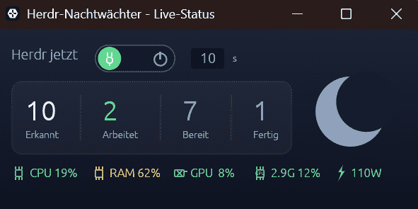

# Herdr Night Watch

A small Windows tray app for the existing fail-closed Herdr night watcher.

The app controls the robust WSL background watcher; it does not replace it.

This repository contains the Rust tray app, the Python watcher, Windows scripts, tests, documentation, and a tested Windows executable.

## Why this tool exists

We often let Herdr run overnight because Compound Engineering plans can become very large. Once such a plan starts, several agents may continue working autonomously for hours. The computer does not need to stay on all night, though: when all work is complete, Windows should reliably enter sleep mode or shut down.

That handoff between “Herdr is finished” and “Windows may go to sleep” was not reliably solved before. Herdr Night Watch closes that gap: it monitors the agents fail-closed, makes the current state visible, and performs the selected power action only after a configurable warning period.

The interface supports Deutsch and English. Change the language from the tray right-click menu under “Sprache / Language”.

## Agent support and setup

Herdr Night Watch is not tied to one coding agent. It works with Codex, Claude Code, or any other agent that Herdr can report. The only required integration is Herdr itself.

## How the pieces fit together

Codex and Claude Code do the work. Herdr is the shared terminal runtime that knows whether their agents are still working, waiting, or finished. Herdr Night Watch does not read prompts, source code, or terminal output. It only asks Herdr for the current agent states and uses that answer to decide whether Windows may sleep.

```text
Codex / Claude Code / other coding agents
                    |
                    v
        Herdr terminal runtime in WSL
                    |
                    v
  herdr-night-watch.py checks agent states
                    |
                    +-- work remains -> keep watching
                    +-- status uncertain -> do nothing (fail-closed)
                    +-- all work complete -> visible warning period
                                             |
                                             v
                                  Windows sleep or shutdown

Windows tray app = configuration, live status, start/stop, and cancellation
```

The tray app never launches, stops, or controls Codex or Claude Code. It only watches the state Herdr reports. This is why one Night Watch installation can support mixed Herdr sessions, for example Codex and Claude Code working in parallel.

Open **Open setup** from the tray right-click menu to set:

- the name of your WSL distribution, for example `Ubuntu`;
- the WSL path to `herdr-night-watch.py`.

For a checkout of this repository, the path normally looks like `/home/your-name/projects/herdr-night-watch/watcher/herdr-night-watch.py`. The setup is stored locally in the Windows user registry and is never committed to Git.

## Requirements

- Windows with WSL installed;
- a WSL distribution with Python 3 and the Herdr CLI available;
- Codex, Claude Code, or another agent running inside Herdr when there is work to monitor;
- the Herdr Night Watch tray app running while a night run is active.

## Live status



The live window is intentionally compact: Herdr counts and the night-mode controls remain in the main panel, while the equal-width footer provides a quick hardware glance without affecting the watcher. CPU, RAM, GPU, VRAM utilization, and NVIDIA GPU power use a soft traffic-light palette: green for normal load, pastel yellow for medium load, and pastel red for high load. Missing hardware telemetry is shown as `—` rather than guessed.

## Usage

- **Start night mode**: continuously monitors all agents currently reported by Herdr and only shuts down Windows after the configured quiet period.
- **Observe only**: runs the same monitoring flow without performing a shutdown.
- **Stop and cancel shutdown**: ends the run and cancels only a pending shutdown scheduled by the watcher.
- **Demo: simulate completion**: shows the quiet period and shutdown warning within a few seconds. It can never shut down Windows.
- **Open live status**: opens a freely movable status window that can be closed at any time. Left-clicking the tray icon opens it; right-clicking shows the menu.
- The live-status footer gives a compact, informational view of CPU, RAM, GPU, occupied VRAM, and an available GPU power reading. Pastel yellow and red indicate medium and high utilization. Unsupported values show `—` and never affect the watcher.
- **Start with Windows**: starts only the tray app when you log in. It does not automatically arm a night run.

The Python watcher lives at `watcher/herdr-night-watch.py`; its safety contract remains authoritative.

## Installation

1. Set up WSL with a working Herdr CLI and an Ubuntu distribution.
2. Choose a WSL path for `watcher/herdr-night-watch.py`.
3. Start `dist/Herdr-Nachtwaechter.exe` and open **Open setup** from its tray menu.
4. Enter the WSL distribution and watcher path, then start a night mode from the tray app.

The EXE is a convenience artifact for Windows. For other architectures or after source changes, rebuild it from `src/`.

The tooltip and live status window show the current Herdr count for information only. If Herdr cannot be read, the app never invents a number and the shutdown decision remains fail-closed.

In a real night run, five seconds of confirmed inactivity starts the 300-second warning period. The Windows dialog offers `Cancel`; choosing it stops the watcher and cancels that specific pending shutdown.

## Maintenance documentation

The complete technical documentation for future changes starts at [docs/INDEX.md](docs/INDEX.md). It covers states, the Windows/WSL boundary, builds and delivery, and safe troubleshooting. Runtime data, logs, and personal state files do not belong in Git.

## Icon

The tray icon is based on Google’s official Material `bedtime` icon and is licensed under Apache-2.0. Its color changes by state: gray, green, blue, yellow, or red.
